# Nostalgic FIFA 17 Player Database

Relive the glory days of FIFA 17 with this interactive player database featuring advanced statistics, social features, and cutting-edge comparison tools.

## Screenshots

### Home Page

### Login / Register

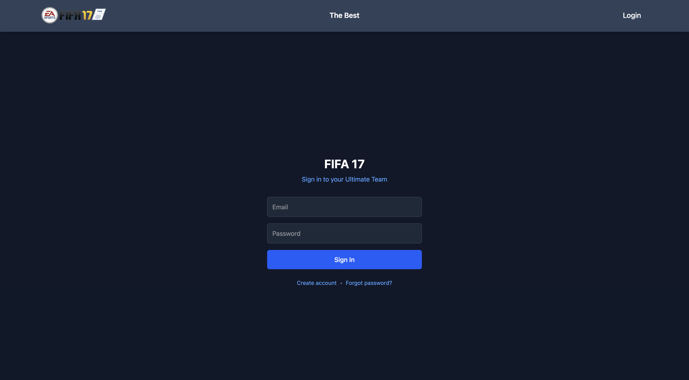
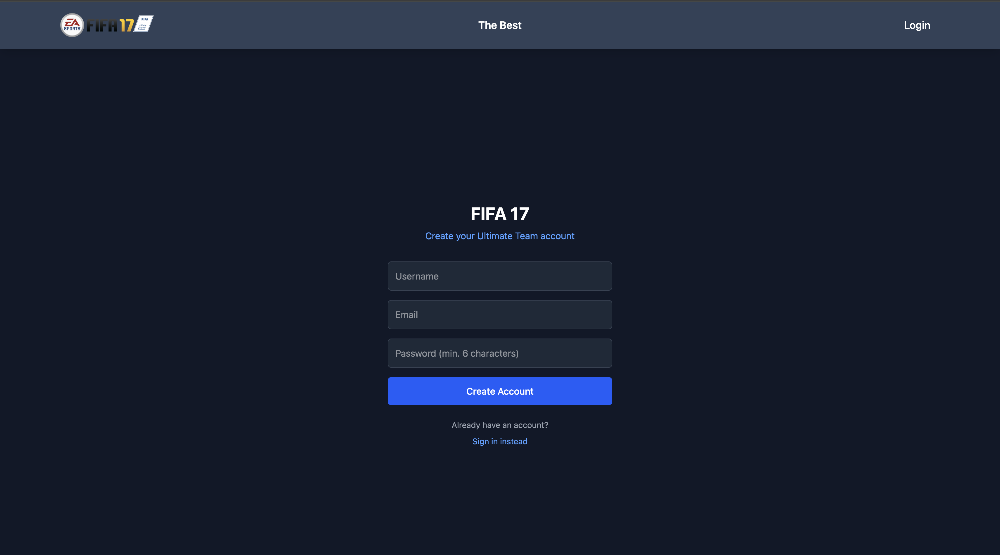

### Playerlist / Details

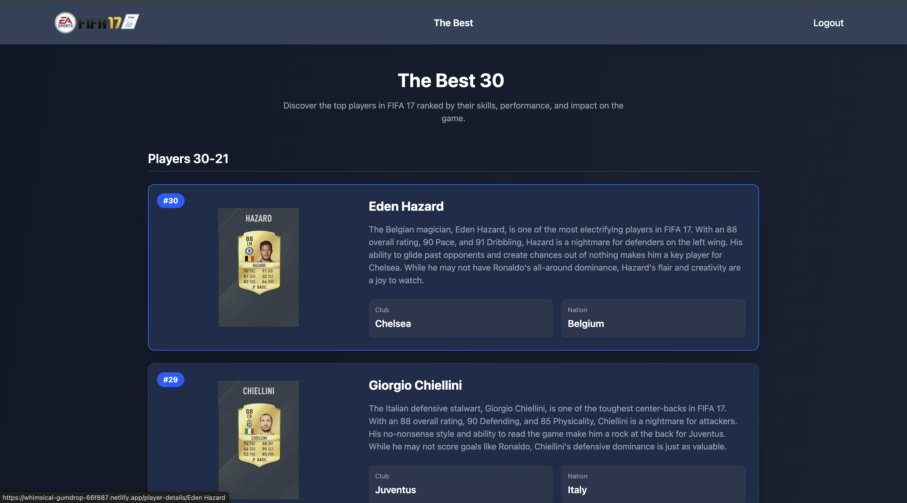
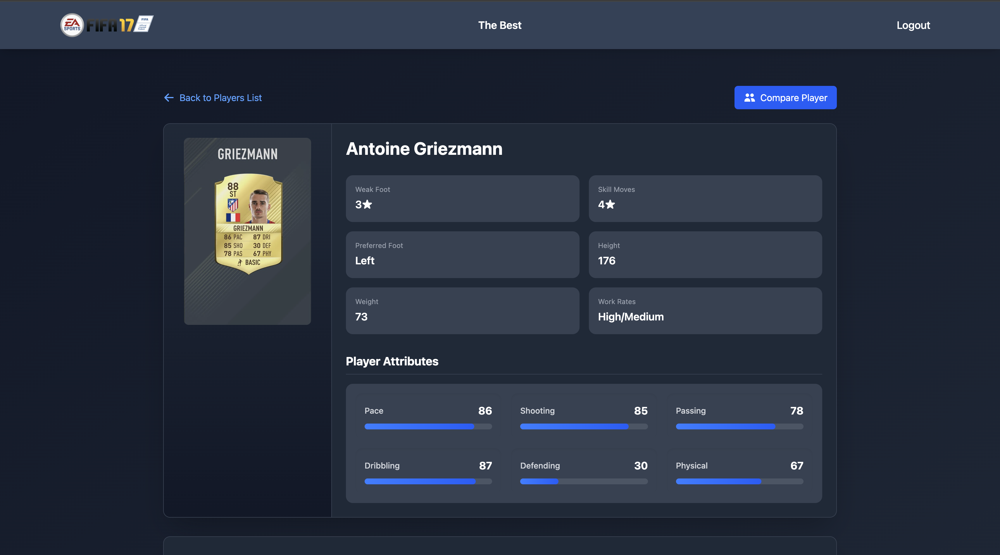
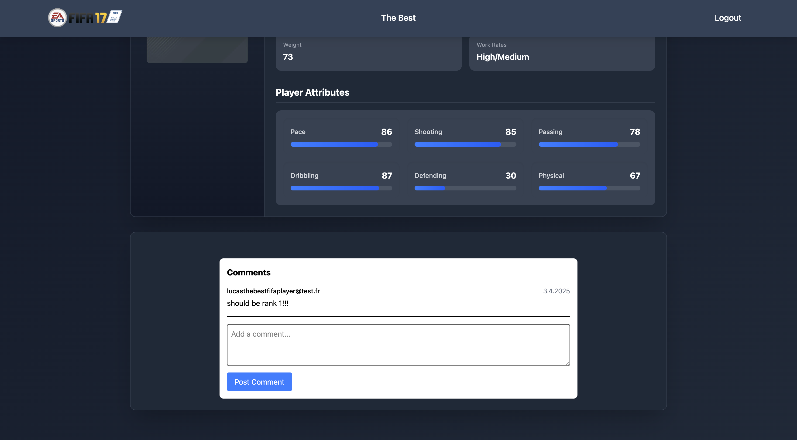

### Player Comparison

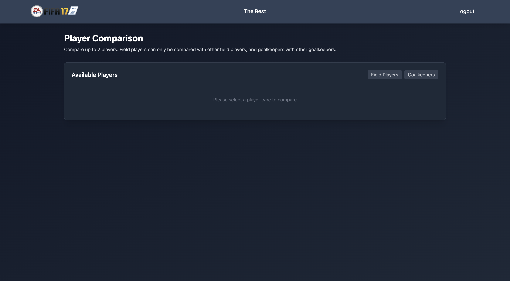
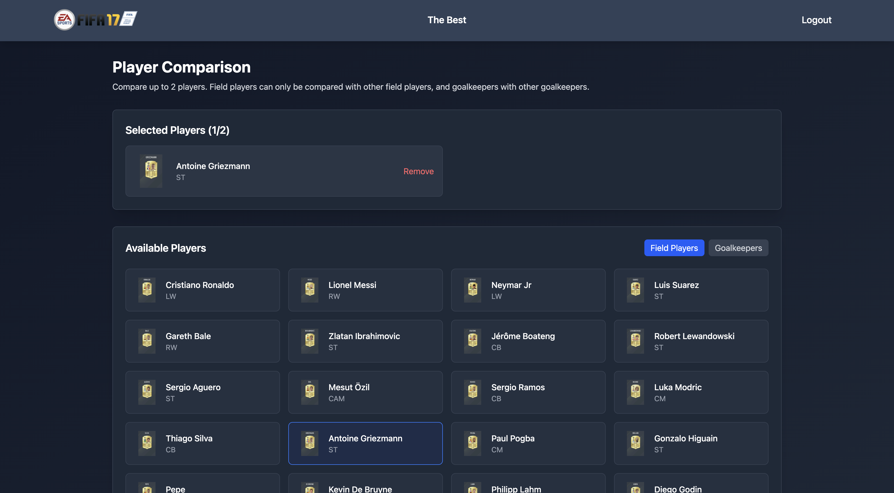
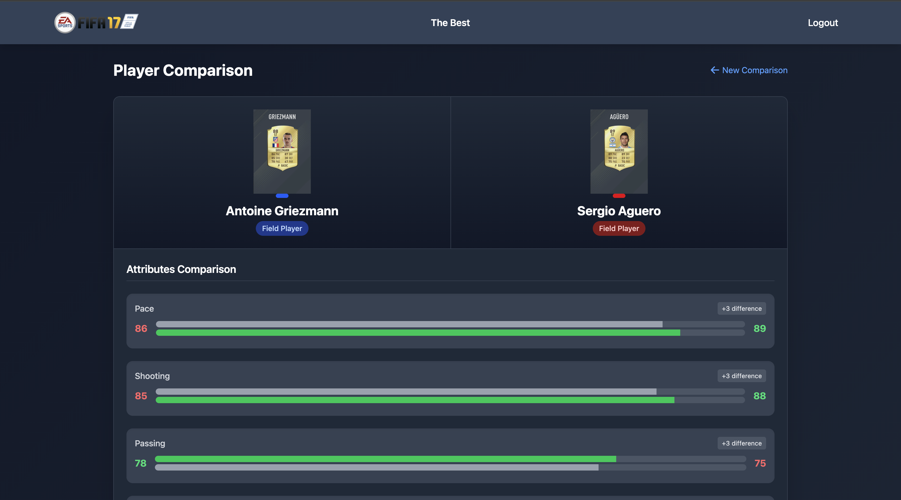
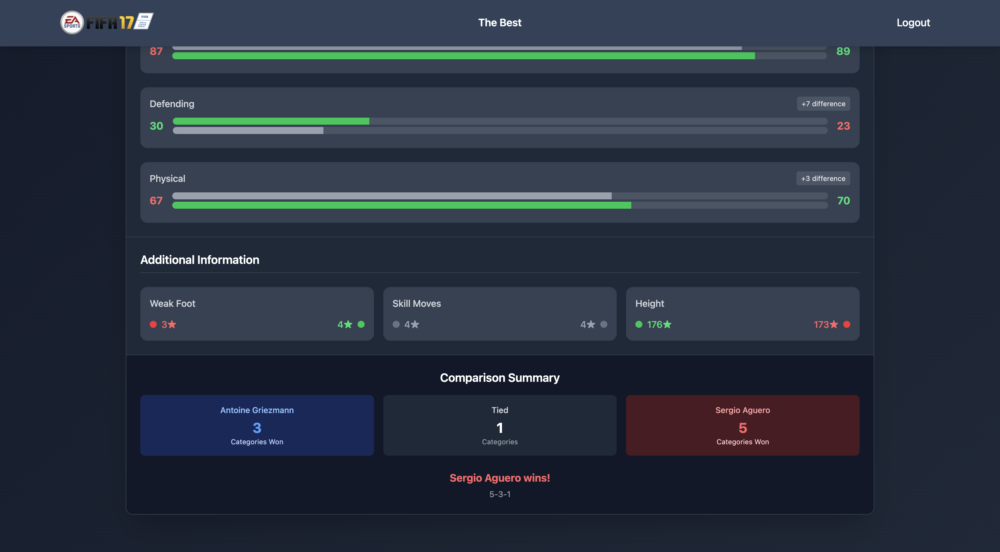
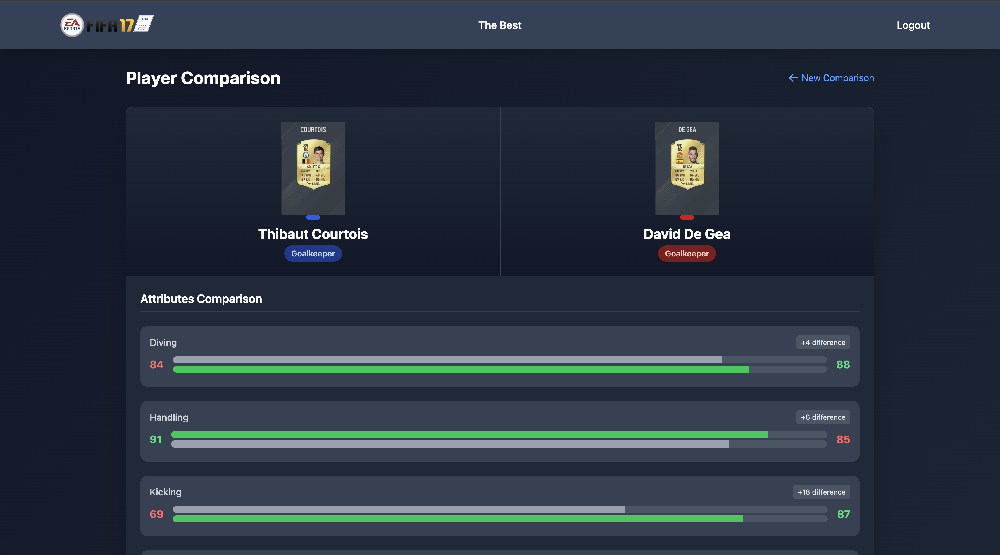
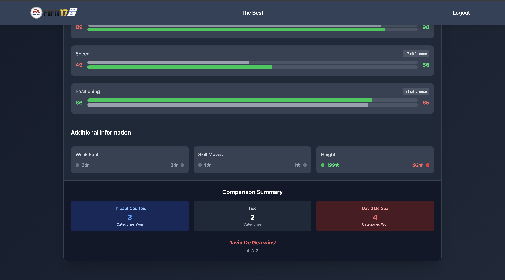

## Live Demo

[Visit the live website](https://whimsical-gumdrop-66f887.netlify.app/) to experience the full interactive database.

## Features

### Player Profiles

- 30+ iconic FIFA 17 players with authentic stats
- Detailed attributes breakdown (Pace, Shooting, Dribbling, etc.)
- Position-specific stat displays (Field players vs Goalkeepers)
- High-quality player images and metadata

### Advanced Comparison Tool

- **Position-aware matching**: Position based comparison constraints
- **Visual stat showdown**: Side-by-side attribute bars with color-coded advantages
- **Head-to-head metrics**: Clear indicators of who performs better in each category

### Real-Time Social Features

- Firebase-powered comments on every player profile
- Authenticated users can post and delete their own comments
- Smooth real-time updates without page refresh
- User profile integration

### Secure Authentication

- Email/password login with Firebase Auth
- Username reservation system
- Protected routes for logged-in users
- Session persistence

## 🛠 Tech Stack

| Category | Technologies                    |
| -------- | ------------------------------- |
| Frontend | React, TypeScript, Tailwind CSS |
| Backend  | Firebase (Auth, Firestore)      |
